## Performance Testing

Screenshot of the performance testings:
1. test_plan_1.jmx (all-student)
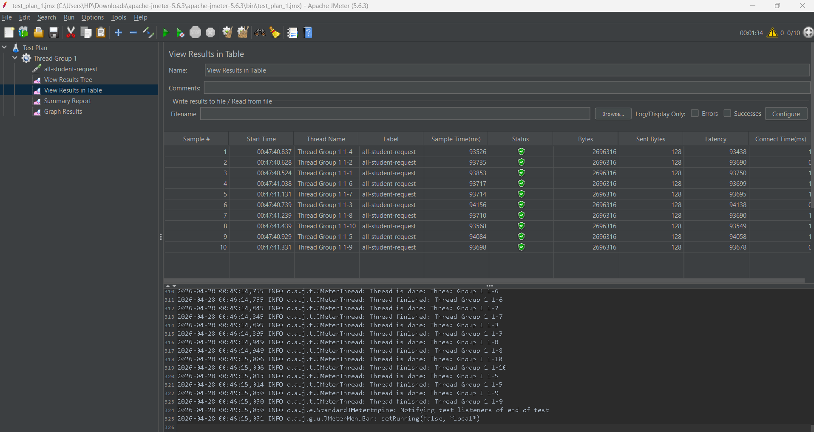
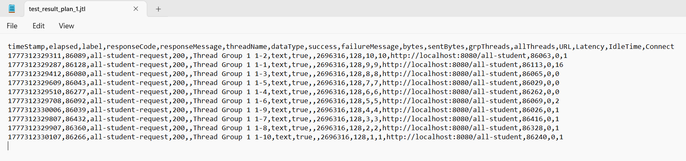

2. test_plan_1_highest_gpa.jmx (highest-gpa)
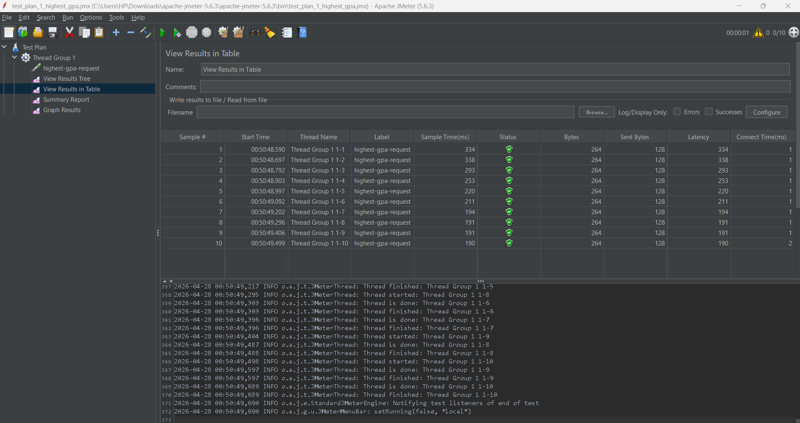
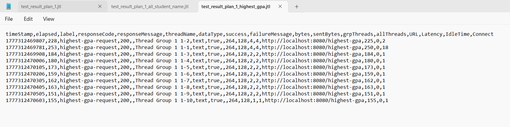

3. test_plan_1_all_student_name.jmx (all-student-name)
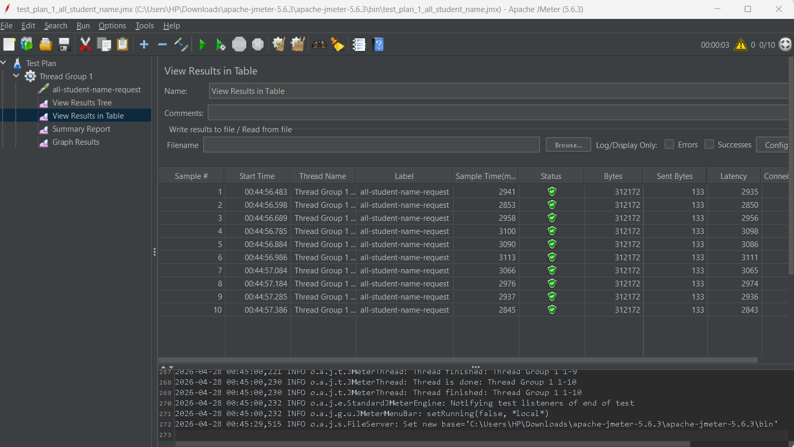
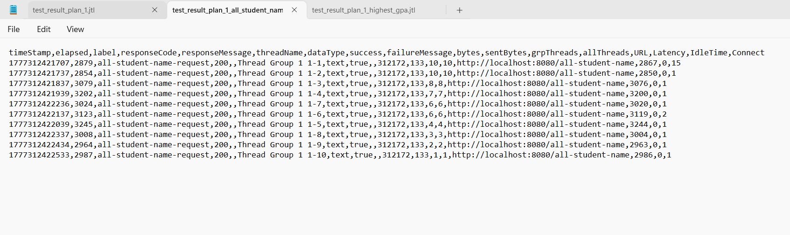

## Profiling & Optimization

1. **/all-student (optimizing getAllStudentWithCourse)**

Comparison before and after optimization:
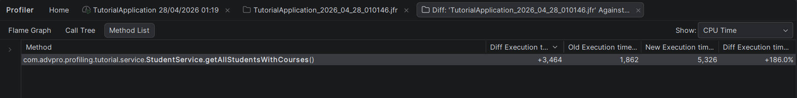

JMeter performance for /all-student endpoint after optimization:
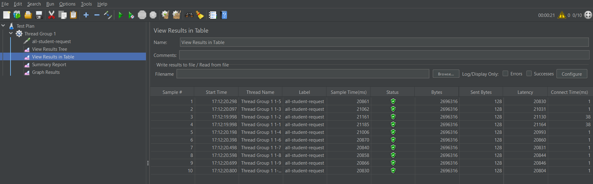

Dapat dilihat pada kode sebelumnya, `getAllStudentWithCourse` memakan waktu 5,3 detik, dan setelah dioptimisasi, waktu respon berhasil dikurangi menjadi 1,8 detik. Hal ini menunjukkan peningkatan performa yang signifikan setelah melakukan optimasi pada endpoint tersebut.

1. **/highest-gpa (optimizing findStudentWithHighestGpa)**

Comparison before and after optimization:
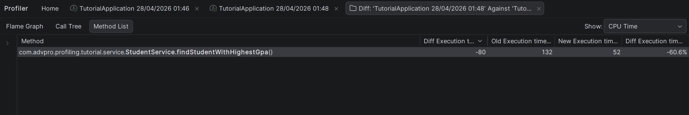

JMeter performance for /highest-gpa endpoint after optimization:
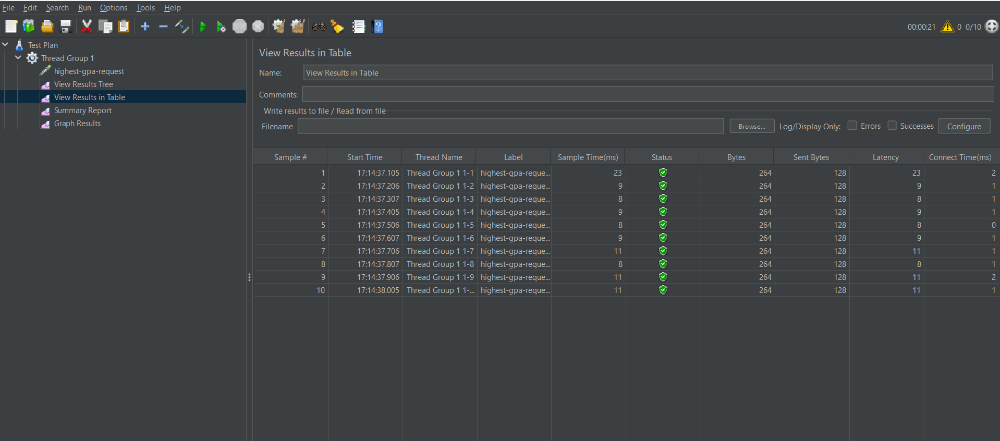

Dapat dilihat pada kode sebelumnya, `findStudentWithHighestGpa` memakan waktu 132ms, dan setelah dioptimisasi, waktu respon berhasil dikurangi menjadi 52ms. Hal ini menunjukkan peningkatan performa yang signifikan setelah melakukan optimasi pada endpoint tersebut.

3. **/all-student-name (optimizing joinStudentNames)**

Comparison before and after optimization:
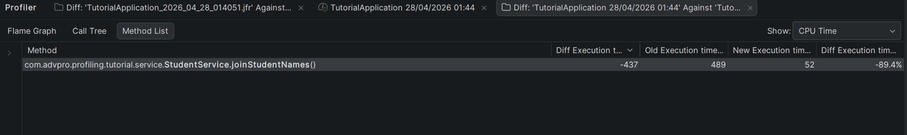

JMeter performance for /all-student-name endpoint after optimization:
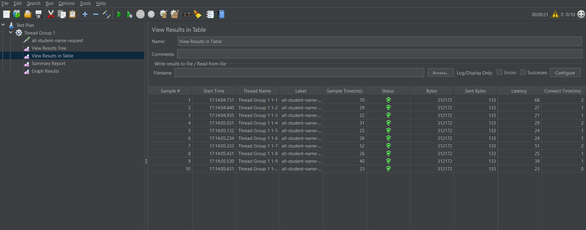

Dapat dilihat pada kode sebelumnya, `joinStudentNames` memakan waktu 489ms, dan setelah dioptimisasi, waktu respon berhasil dikurangi menjadi 52ms. Hal ini menunjukkan peningkatan performa yang signifikan setelah melakukan optimasi pada endpoint tersebut. 

## Is there an improvement from JMeter measurements?

Ya, tentu saja ada peningkatan performa yang signifikan setelah melakukan optimasi pada ketiga endpoint tersebut. Sebelum optimasi, ketiga endpoint mengalami waktu respon yang cukup lama, terutama pada endpoint `/all-student`. Setelah optimasi, waktu respon untuk ketiga endpoint tersebut berhasil dikurangi secara drastis. Hal ini menunjukkan bahwa optimasi yang dilakukan berhasil meningkatkan performa aplikasi secara keseluruhan, dan memberikan pengalaman pengguna yang lebih baik.

## Reflection

1. Perbedaan utama terletak pada pendekatannya. JMeter menggunakan pendekatan black-box yang berfokus pada simulasi beban pengguna untuk mengukur metrik eksternal seperti throughput dan response time di tingkat infrastruktur. Sebaliknya, IntelliJ Profiler menggunakan pendekatan white-box untuk membedah metrik internal aplikasi di tingkat kode saat berjalan, seperti alokasi memori, penggunaan CPU, dan durasi eksekusi method spesifik.

2. Proses profiling membantu mengidentifikasi titik lemah dengan cara memetakan eksekusi kode ke dalam visualisasi analitik seperti Flame Graph atau Call Tree. Pemetaan ini memungkinkan pengembang untuk melihat secara presisi baris kode mana yang memakan waktu komputasi terlama atau objek mana yang menyebabkan penumpukan memori, sehingga perbaikan dapat difokuskan langsung pada akar masalah fungsional.

3. IntelliJ Profiler terbukti sangat efektif dalam menganalisis dan mengidentifikasi bottleneck karena integrasi langsungnya di dalam antarmuka IDE. Hal ini memungkinkan pengembang untuk dengan mudah menavigasi dari hasil profiling ke kode sumber yang relevan, serta melakukan iterasi cepat dalam proses optimasi tanpa harus beralih ke alat eksternal atau melakukan setup yang rumit. IntelliJ Profiler juga menyediakan berbagai mode profiling (CPU, Memory, Threads) yang dapat disesuaikan dengan kebutuhan analisis spesifik.

4. Tantangan utama yang sering dihadapi adalah overhead dari alat profiler yang dapat mendistorsi performa asli aplikasi, serta potensi bias metrik pada JMeter akibat fluktuasi latensi jaringan/hardware lokal. Untuk mengatasinya, kita bisa menggunakan mode sampling pada profiler untuk meminimalisir beban tambahan pada aplikasi saat diukur. Sedangkan untuk performance testing, kita bisa menjalankan JMeter di lingkungan staging yang spesifikasinya dibuat semirip mungkin dengan production, serta operasikan alat pengujinya dari server khusus yang stabil, bukan dari laptop pribadi.

5. Manfaat utamanya adalah kita bisa melihat langsung bagian kode mana yang memakan banyak memori atau membuat CPU bekerja terlalu keras saat aplikasi sedang berjalan. Ini sangat berguna untuk menemukan bottleneck dalam kode, seperti proses yang lambat atau boros memori yang biasanya sulit ditemukan hanya dengan pengujian biasa.

6. Perbedaan hasil tersebut sangat wajar karena keduanya mengukur hal yang berbeda. JMeter mengukur performa dari luar secara keseluruhan termasuk hambatan jaringan dan database, sedangkan Profiler hanya mengukur kecepatan eksekusi kode murni dari dalam aplikasi. Cara menanganinya adalah dengan memastikan profiling dilakukan di server yang sama dengan target tes JMeter, bukan di laptop lokal. Jika Profiler menunjukkan kode sudah berjalan cepat namun JMeter masih mendeteksi kelambatan, berarti masalahnya ada di luar kode aplikasi, seperti koneksi jaringan yang lambat atau proses database yang berat. Untuk menangani ini, kita bisa melakukan investigasi lebih lanjut pada infrastruktur, seperti memeriksa log server, memantau penggunaan sumber daya, atau mengoptimalkan kueri database.

7. Setelah menemukan sumber masalahnya, strategi optimasi difokuskan pada perbaikan yang paling berdampak. Misalnya, menyederhanakan logika kode yang berbelit-belit, memperbaiki kueri database, atau menambahkan sistem cache agar aplikasi tidak perlu mengambil data yang sama berulang kali. Untuk memastikan optimasi ini tidak merusak fitur yang sudah berjalan, kuncinya adalah mengandalkan pengujian otomatis (unit test dan integration test) yang diintegrasikan ke dalam pipeline CI/CD (Continuous Integration/Continuous Deployment). Dengan CI/CD, setiap kali kode yang sudah dioptimasi di-commit atau di-merge, sistem akan otomatis menjalankan seluruh pengujian tersebut. Jika proses di CI/CD berhasil dan lulus tanpa error (status hijau), barulah kita bisa yakin bahwa kode tersebut berhasil dipercepat tanpa mengubah atau merusak fungsi aslinya sama sekali.